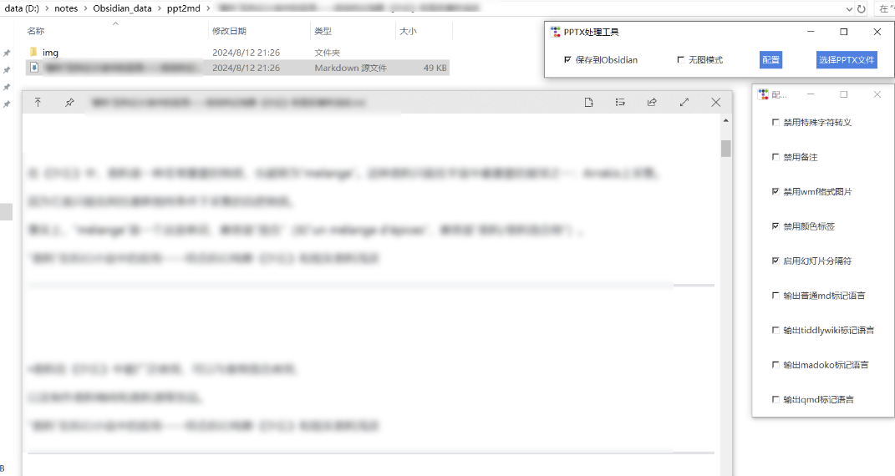

# pptx2md_simple_GUI

这是一个基于 [pptx2md](https://github.com/ssine/pptx2md) 项目的简单工具，用于将 PPTX 文件转换为 Markdown 文件。它提供了一个基于 tkinter 的图形界面，方便用户进行转换操作。

## 特点

* 简单易用：因为[pptx2md](https://github.com/ssine/pptx2md)很好用，所以只需选择 PPTX 文件，即可一键转换为 Markdown 格式。
* 图形界面：丑且简单。

## 使用方法

1. 安装依赖：`pip install ttkbootstrap pptx2md`
2. 下载或克隆此仓库。
3. 运行 `pptx2md_simple_GUI.py` 文件。
4. 点击 "选择 PPTX 文件" 按钮，选择要转换的 PPTX 文件。
5. 转换完成后，将在与 PPTX 文件相同的目录下生成一个 Markdown 文件，并自动在默认浏览器中打开。

## 依赖

* Python 3 (测试环境: Python 3.11)
* [pptx2md](https://github.com/ssine/pptx2md)
* ttkbootstrap

---

### English

# pptx2md_simple_GUI

This is a simple tool based on the [pptx2md](https://github.com/ssine/pptx2md) project, used to convert PPTX files to Markdown files. It provides a tkinter-based graphical interface for easy conversion.

## Features

* **Easy to use:** Because [pptx2md](https://github.com/ssine/pptx2md) is very easy to use, you only need to select the PPTX file and click to convert it to Markdown format.
* **Graphical interface:** Ugly and simple.

## Usage

1. Install dependencies: `pip install ttkbootstrap pptx2md`
2. Download or clone this repository.
3. Run the `pptx2md_simple_GUI.py` file.
4. Click the "Select PPTX File" button and choose the PPTX file you want to convert.
5. After the conversion is complete, a Markdown file will be generated in the same directory as the PPTX file and automatically opened in your default browser.

## Dependencies

* Python 3 (Tested on: Python 3.11)
* [pptx2md](https://github.com/ssine/pptx2md)
* ttkbootstrap 
